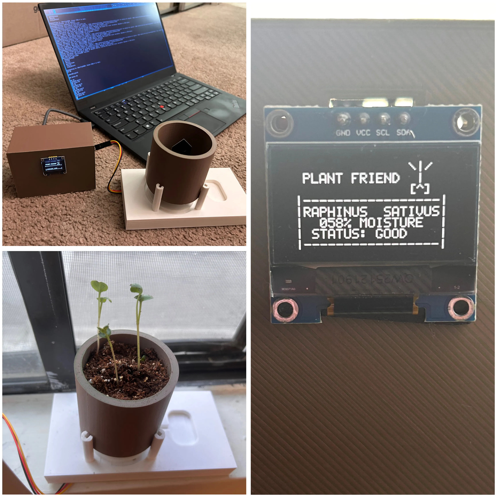
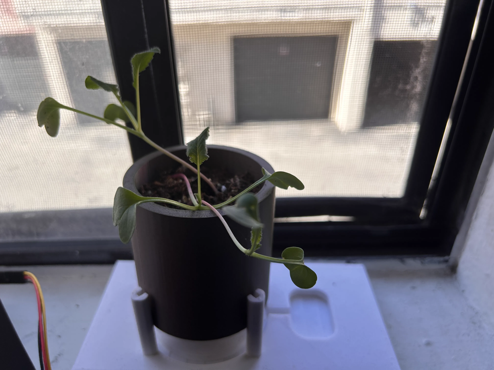

## Plant Friend Documentation

## Goal: take the guesswork out of growing plants using accessible hardware. 

## How it works

This is a moisture monitoring system that takes the guesswork out of watering your... radishes. Well, I tested the design using radishes, as they grow quickly and require a relatively high soil moisture to grow. 

The small OLED display is updated every 5 minutes with the soil moisture (expressed as % of field capacity) and current status (high, good, low). Status may be adjusted for any plant's ideal soil moisture (more info in the following section). 

In the same 5 minute loop, the Arduino writes both the raw data from the sensor, and the calculated moisture percentage to a .CSV file in the root of the microSD card. 

## Instructions

If you'd like to build a plant friend for yourself, throwing this project together is very easy. The .3mf files are provided, and are designed to be printed without supports. 
Additionally, tests for the display, SD card, and sensor calibration are in their respective folders. Be sure to check each component's functionality before proceeding with the full build. 

*Calibration:* 
1. Prepare a container of dry soil. 
2. Compile and flash the moisture_calibration.ino script while the capacitive moisture sensor is connected to your microcontroller. You will see a serial ouput from the sensor on your computer screen. 
3. Insert the sensor into the soil, and write down the raw serial output. This is your dry value
4. Add a generous amount of water to the soil and allow it to drain. 
5. Repeat step 3. This is your wet value. 

*Status & Script Modification:*
1. Open the full_test script using your favorite text editor or IDE
2. Change the MOISTURE_PIN to whatever analog pin you're using on the arduino for the sensor
3. Change DRY_VAL and WET_VAL to the outputs from calibration 
4. Inside the first loop, adjust statuses as needed. 
5. If planting anything other than a radish, pick another name and place it in the 5th line of the oled.home initialization. 

*I recommend changing the sleep loop to an hour or longer. You don't need 3500 datapoints per week, unless you're into that sort of thing.* 

## Materials 

- 1x Arduino Nano (any microcontroller with >32kB flash memory)
- 1x SD1306 0.96" OLED display
- 1x Micro SD card adapter with breakout board
- 1x Micro SD card (<8gb preferred)
- 1x Capacitive soil moisture sensor (my recommendation is GikFun brand)
- 1x Mini breadboard or perfboard
- 13x Jumper wires (if using breadboard)
- ~256g PLA filament at 15% infill

## Does it work? 

### You tell me.
